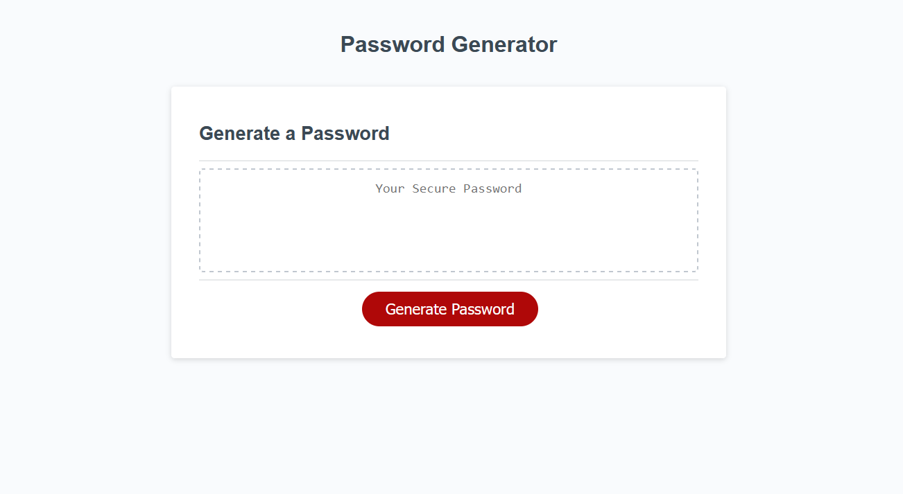

# Bootcamp Challenge 03: JavaScript - Password Generator

## Description

Provide a short description explaining the what, why, and how of your project. Use the following questions as a guide:

- What was your motivation?
- Why did you build this project? (Note: the answer is not "Because it was a homework assignment.")
- What problem does it solve?
- What did you learn?

## Installation

N/A

## Usage

Click the button and navigate through the prompts and confirmations to choose password length and characters used (uppercase letters, lowercase letters, numeric characters and special characters). The password will appear in the middle of the page.

[Link to GitHub Pages website](https://kevinpatto.github.io/Bootcamp-Challenge-03-JavaScript-Password-Generator/)

## Credits

N/A

## License

N/A